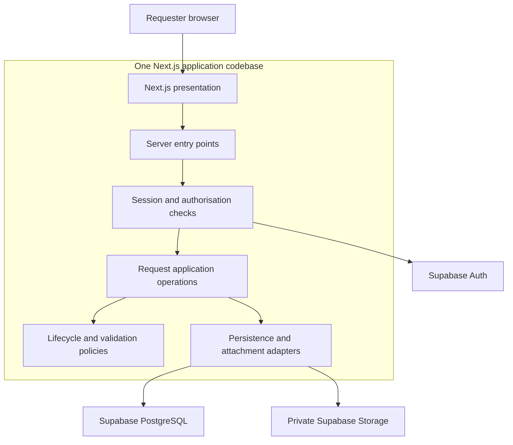
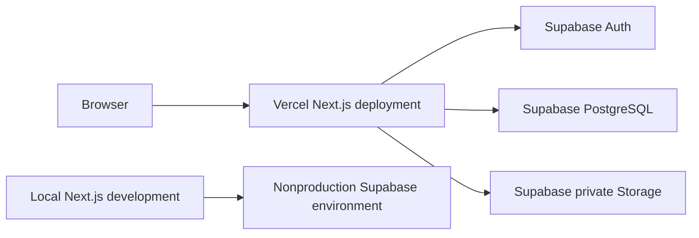

# CivicConnect Milestone 2 Architecture and Frontend

**Author:** Ryno Goetz  
**Version:** 0.2 — 30 September 2026  
**Status:** Contribution for peer review and PED v2.0 integration  
**Reviewers:** Steven Riaan Piek and Willem Booysen

## 1 Purpose and baseline

This contribution defines the application architecture, frontend interaction and setup responsibilities for CivicConnect. The selected technology direction is JavaScript and Next.js, with Supabase PostgreSQL, Auth and private Storage, and Vercel as the deployment direction. Ryno owns the Next.js setup and frontend; Steven owns the database and server-side request operations. Willem owns the detailed design decisions and PED integration.

The Master Project Brief governs this work, particularly sections 9–14, 18.1 and 20.2. The M2 brief adds architecture, technology, initial design, application and traceability expectations in sections 5–9. This contribution supplies material for the existing PED to evolve into v2.0; it is not a separate final milestone report or a claim of team sign-off.

PED v1.0 remains the approved requirements baseline. Its identifiers, acceptance criteria and history are preserved. The initial path is **submit a request → validate → save → return confirmation → retrieve the authorised request**. Building this path does not remove the remaining baselined requirements.

### Revision history

| Version | Change |
| --- | --- |
| 0.1 | Initial architecture alternatives, provisional technology comparison and setup preparation. Retained in Git history. |
| 0.2 | Aligns the architecture with accepted ADR-001 and Steven's merged data model; adds frontend design, integration boundaries, setup plan and handoff evidence. Replaces the provisional preference to evaluate .NET first. |

The earlier .NET recommendation was provisional. Assignment 1 compared hypothetical stacks; it did not commit CivicConnect to C# or TypeScript. The accepted project decision is ADR-001. No second technology ADR is introduced here. Its bootstrap ownership wording will be reconciled separately with Ryno's confirmed setup responsibility.

## 2 Architecture drivers

These contribution identifiers continue the Phase 1 draft. Steven should link them into the shared RTM without replacing existing requirement identifiers.

| Driver | Baseline and risk links | Design response |
| --- | --- | --- |
| RG-ASR-01 Authorised access | FR-003, FR-006, FR-008, FR-009, FR-012; NFR-001; R3 | Derive identity from the authenticated session. Enforce each protected operation on the server and restrict database access. Hiding a button is not authorisation. |
| RG-ASR-02 Sensitive information | FR-008; NFR-002; R3 | Return only permitted fields; keep attachments private and secrets outside browser bundles. Administrative access does not imply business-data access. |
| RG-ASR-03 Consistency and attribution | FR-010–FR-012, FR-016; NFR-003, NFR-005 | Give lifecycle rules one owner. Keep related request and history writes atomic and attributable. Define concurrency behaviour before implementing updates. |
| RG-ASR-04 Responsive operation | NFR-006; R8, R9 | Avoid an unnecessary separate API service; scope and index queries with Steven. Measure performance against the approved workload. |
| RG-ASR-05 Recoverability | NFR-007; R8, R9 | Identify database, attachment and configuration recovery needs. Hosted services remain dependencies and do not prove recovery targets. |
| RG-ASR-06 Maintainability | NFR-008; CON-001, CON-002, CON-007; R6 | Use clear internal responsibilities, one JavaScript application and reproducible setup. Reserve time for integration and both non-author reviews. |
| RG-ASR-07 Understandable interaction | FR-001, FR-003–FR-005; NFR-004 | Use labelled controls, field errors, visible progress and clear confirmation only after persistence succeeds. |

NFR-006 uses **1,000 seeded requests and three concurrent representative users**: at least 95% of retrieval, search, filtering, sorting and management-view operations must finish within **two seconds**, and at least 95% of valid submissions must return acknowledgement within **three seconds**. Record the environment and sample counts when measuring.

NFR-007 requires restoration within **30 minutes** and a maximum planned data-loss window of **24 hours**. These are inherited targets, not achieved results. A build or frontend demonstration does not verify them.

The baseline already contains working access and lifecycle policies. Detailed permission cases, reopening refinements and retention still require controlled resolution; they must not be invented in the UI. Material changes follow Master Brief section 14.

## 3 Architecture decision RG ADR 01

**Decision reference:** RG-ADR-01, retained from the Phase 1 contribution.  
**Status:** Proposed for team approval; implementation direction for Ryno's contribution.  
**Owner:** Ryno Goetz.  
**Context:** One organisation, three members, limited daily capacity, consistent request/history data, and the selected Next.js stack.

| Alternative | Benefit | Trade off and assessment |
| --- | --- | --- |
| Simple layered application | Small setup with presentation, business and data layers. | Viable, but horizontal layers alone make it easier for request rules, access rules and infrastructure to become mixed. |
| Modular monolith with internal layers | One application codebase and release boundary; explicit request, access and infrastructure responsibilities. | Requires discipline to preserve boundaries. Preferred for current scope and team capacity. |
| Independently deployed services | Separate deployment and scaling of capabilities. | Adds network contracts, distributed failures and consistency/recovery coordination without a demonstrated need. |

**Decision:** Organise CivicConnect as a modular monolith implemented in one Next.js application. Keep the frontend, server entry points, request operations and infrastructure responsibilities distinct within it. Use the managed services selected in ADR-001 for durable data, authentication and attachments.

This is a logical and release boundary, not a claim that Vercel runs one persistent server process. Vercel may execute server functionality across separate function instances. Durable state must therefore live in PostgreSQL or Storage, not process memory or a local deployment filesystem.

The design addresses RG-ASR-01–07 without adding a second backend deployment. It introduces shared deployment and dependency coupling: a framework change or broken application release can affect several capabilities. Isolated modules and reviewed interfaces limit that coupling, but do not eliminate it.

**Revisit when:** measured workloads require independent scaling; an external consumer requires a stable public API; or a deployment constraint makes the selected application boundary unsuitable. Record the evidence and consequences before changing the decision.

**Related evidence:** ADR-001; PED NFR-001–008; A2 application-service, transition-policy and integration research. Willem's final design ADRs will determine the detailed approaches. This architecture does not approve those choices on his behalf.

## 4 Components and deployment



The diagram shows the target responsibilities and interaction direction. A module box does not require a separate service, class hierarchy or deployment. The frontend can be developed against a clearly labelled preview boundary while the real server operations are pending.

| Responsibility | Planned location and owner | Boundary |
| --- | --- | --- |
| Pages and shared presentation | `src/app/`, `src/components/` — Ryno | Navigation, form, feedback, request details and accessibility. No database credentials or authoritative permission rules. |
| Request frontend | `src/features/requests/` — Ryno | Request-specific form state, browser validation and rendering server results. |
| Server operations | `src/server/requests/` — Steven | Validate session and input, authorise the action, coordinate request persistence and return a permitted result. |
| Data and service adapters | `src/server/`, `supabase/` — Steven with Willem's design input | Schema, migrations, row policies and provider integration; exact files are established during implementation. |
| Detailed lifecycle and attachment design | Relevant request and infrastructure modules — Willem with Steven | Final decisions and corresponding implementation where the affected area has begun. |

These are proposed locations until created. Use server-only boundaries for privileged modules. Avoid importing infrastructure into client components. Internal operations can call JavaScript functions; a separate REST service is not needed simply to connect modules. The actual Server Action or Route Handler choice must be documented when the boundary is established. [Next.js authentication guidance](https://nextjs.org/docs/app/guides/authentication)



Local development and hosted previews must use fictional data and nonproduction configuration. A Vercel preview does not automatically provide an isolated database. The team must agree the Supabase project arrangement and avoid shared preview writes corrupting demonstration data. Hosted previews and production release are different readiness claims. [Vercel environments](https://vercel.com/docs/deployments/environments)

PostgreSQL is a shared availability dependency; an outage prevents reliable saves and reads. Report the failure without showing a false success. Do not introduce a cache as the authoritative request store. Database backups and actual Storage object backups must both be considered, followed by a timed restore. [Supabase backups](https://supabase.com/docs/guides/platform/backups)

## 5 Technology rationale and setup direction

ADR-001 is the accepted technology record. This section connects it to Ryno's implementation responsibilities without changing that shared ADR.

| Choice | CivicConnect fit | Cost or limitation |
| --- | --- | --- |
| JavaScript with Next.js and React | One language across frontend and server; supports request forms and protected server operations in one application. Matches the team's JavaScript experience. | Next.js and Supabase still require learning. JavaScript lacks TypeScript's static checks, so validation and meaningful tests remain necessary. |
| Separate React and Express | Familiar separation and an explicit API boundary. | Adds server setup, deployment and interface coordination not required by the first slice. |
| ASP.NET Core with C# | A genuine A1 alternative with an integrated server ecosystem. | Adds another language and backend boundary to the chosen React direction. The A1 hypothetical result does not override the team's project-specific decision. |
| Supabase PostgreSQL | Fits Request, Requester, Category, Status and history relationships, constraints and transactions. | Requires correct schema, access policies and recovery procedures; using the service alone does not meet NFRs. Steven owns persistence justification. |
| Vercel | Matches the selected Next.js deployment direction. | Network, plan, collaboration and usage restrictions must be checked before relying on hosted previews. |

The team selected JavaScript because members do not have TypeScript experience. This reduces an immediate learning burden, but does not prove the team already has Next.js expertise. Start with a small runnable frontend, then integrate one protected request operation before expanding functionality.

ADR-001 records Node.js 24 LTS, npm 11.x, Next.js 16 and React 19.3 as the version direction. Bootstrap must record the exact installed versions, commit a lockfile and verify development, lint, tests and production build. Node.js 24.16.0 and npm 11.13.0 were observed on Ryno's device during preparation. Framework installation and institutional-machine compatibility are separate checks. [Next.js installation](https://nextjs.org/docs/app/getting-started/installation) [React versions](https://react.dev/versions)

Retain ADR-001's cost and licensing references; do not assume the free plans guarantee every required environment, collaborator or recovery feature. Confirm account eligibility and current quotas before deployment. No paid subscription or production deployment is authorised by this document.

The setup should include an npm project, JavaScript source, dependency lockfile, `.gitignore`, an environment example containing no secrets, and documented commands. Keep environment files containing credentials untracked. Any `NEXT_PUBLIC_` value is exposed to the browser; privileged keys must never use that prefix. Initial tests should use `node:test` where appropriate, with browser verification of the form and navigation.

## 6 Frontend interaction design

The initial interface focuses on a requester submitting and viewing a request. Staff assignment, management reporting and the rest of the lifecycle remain later work unless the team explicitly expands this slice. They remain in the approved scope.

**Navigation:** Start → New request → confirmation → request details. Provide a requests view when an authorised list operation exists. Until then, an empty or unavailable view must not imply that a database query succeeded.

### Request form

```text
CivicConnect                 New request | My requests

New service request
Required fields are marked with an asterisk.

Title *                    [                         ]
Description *              [                         ]
Category *                 [Select a category       v]
Location *                 [                         ]
Requester identity/contact [From verified profile    ]
Sensitive information *    ( ) No   ( ) Yes
Attachment optional        [Choose file when enabled ]

[Submit request]
Validation and submission feedback appears here.
```

The controlled categories are **Maintenance, IT support, Facility fault, Damaged equipment, Security concern, Lost property and Other**. The integrated form must consume stable category identifiers from Steven's data layer; a category label is not a database UUID.

Requester identity/contact details are required under FR-001. Their exact representation must follow Steven's requester/Auth mapping. Prefer verified profile details; do not trust a browser-supplied requester ID as proof of ownership. The initial frontend can show where these details belong without inventing a completed authentication flow.

Require an explicit sensitive-information answer. An optional attachment must never prevent a valid request without a file. Show file upload only when the private-storage operation, limits and failure handling exist; otherwise clearly state that attachments are not yet available and FR-001 is only partially implemented.

### States and accessibility

| State | Frontend behaviour |
| --- | --- |
| Invalid input | Keep entered values, identify affected fields in text and focus the error summary. Whitespace-only required text is invalid. |
| Submitting | Announce progress and prevent repeated clicks while the operation is pending. This is not a substitute for server-side duplicate protection. |
| Saved | Show the returned request identifier, `Submitted` state and server-generated timestamp; offer an authorised details link. |
| Failed or unavailable | Explain that the save was not confirmed; preserve values for correction or retry. Never fabricate a saved request or success reference. |
| Details loading or unavailable | Announce loading; distinguish unavailable service from a successful empty result. Avoid leaking whether another user's request exists. |

Use visible labels, keyboard-operable controls, visible focus, an error summary linked to fields and status announcements. Do not rely on colour alone. Keep the main form in one readable column on narrow screens. A preview uses fictional examples and states explicitly that data is not saved; it must not collect real sensitive information.

## 7 Integration handoff

This is a **proposed contract**, not an implemented endpoint. Ryno and Steven must agree the final function names and payloads before connecting the frontend. Document the actual boundary in the README once it exists.

| Operation | Input and ownership | Required outcome |
| --- | --- | --- |
| Read submission context | Server-derived user identity; Steven provides authorised requester details and controlled categories. | Frontend can display required identity/contact information and valid category IDs without inventing them. |
| Submit request | Title, description, category ID, location, explicit sensitivity and optional supported attachment. Server derives requester identity, timestamp and initial status. | Safe success result with request ID, status and created time, or field/general failure information. |
| Retrieve request | Request ID plus server-verified session. | Only permitted request fields for an authorised user; safe unavailable/denied outcome otherwise. |

The server validates all input again, verifies identity and access, and uses constraints for durable integrity. PostgreSQL row policies must match application permissions. A service-role key bypasses RLS and must not become a shortcut for normal requester operations. [Supabase row security](https://supabase.com/docs/guides/database/postgres/row-level-security)

Steven's model provides Request, Requester, Category, Status, StatusHistory and a possible later Assignment boundary. Confirm the Auth-to-Requester and history actor references before migration. Keep a request and any initial history record in one database transaction; separate SDK calls do not provide that guarantee. Attachment storage cannot share a PostgreSQL transaction, so its design must handle partial failure and orphaned files explicitly.

Willem should finalise the two design decisions using A2 evidence. The architecture provides places for request policy and an attachment adapter; it does not claim either pattern is implemented. A2's transition policy, application service and narrow storage-interface recommendations are useful inputs, not automatic final decisions.

If a payload or returned field changes, update both consumer and server together, add relevant tests, and update the documented contract and RTM. An external versioned API is deferred until an actual consumer requires it.

## 8 Verification and traceability

The initial trace is **NEED-001 → SCP-001 → FR-001 → RG-ASR-01/02/03/07 → request presentation and application operations → Steven's Request/Requester/Category/Status model → RG-ADR-01 and ADR-001 → code → verification**. The shared RTM must link the actual files and results as they become available.

| Evidence | Responsible contribution | Completion condition |
| --- | --- | --- |
| Setup and frontend | Ryno | Clean install, lint, build and documented run succeed; form navigation, required fields, keyboard flow and failure states are checked. |
| Persistence and server path | Steven | Valid request persists with correct identity, category, timestamp and initial state; invalid/unauthorised requests are rejected; authorised retrieval works. |
| Design evidence | Willem with affected code owner | Two final design decisions have ADRs and visible implementation evidence where the area has begun. |
| Integrated acceptance | All three | Submission survives refresh and is retrieved from persistence; another user cannot read it improperly; initial meaningful automated checks pass. |
| Performance and recovery | Shared later evidence | Measured results meet the approved NFR targets or an approved change records the revised targets. |

Frontend validation tests do not prove server security or persistence. A frontend preview is a partial contribution, not the complete end-to-end M2 demonstration. Record unimplemented functionality honestly and preserve baseline acceptance criteria.

## 9 Risks and remaining coordination

These are updates for Willem to reconcile with the existing register, not competing new shared risk IDs.

| Existing risk | Specific concern | Treatment and owner |
| --- | --- | --- |
| R3 Security | UI-only access checks, exposed keys or overbroad database/storage policies could reveal requests. | Steven implements enforcement; Ryno limits UI data; Willem reviews design. Verify denied cases before shared use. |
| R6 Schedule | Independently built UI and backend may use incompatible identity/category/payload shapes. | Ryno and Steven agree the section 7 contract early and integrate the smallest request path first. |
| R8 Environment | Local setup may work while the target environment or hosted configuration does not. | Ryno records versions and reproducible commands; all members check their environment before the demonstration. |
| R9 Dependencies | Provider outage, project pausing, quotas or missing attachment backups may interrupt service or recovery. | Team confirms plan/configuration, prepares the demo environment and tests recovery before making availability claims. |

Remaining handoffs are Steven's actual schema, requester mapping, policies and callable operations; Willem's final design ADRs and affected interfaces; and joint integration, RTM links, register updates and PED v2.0 sign-off. Update the shared ADR's bootstrap ownership separately, as agreed. Preserve two non-author reviews before substantive work enters `main`.

## 10 AI usage record and sources

**AI register input:** 30 September 2026; Ryno Goetz; OpenAI Codex; architecture and frontend documentation. Codex helped reconcile the earlier draft with the selected stack and data model, draft diagrams and handoff boundaries, and check source consistency. Verification used the Master Brief, M2 brief, approved PED, merged ADR-001 and data model, assignment evidence and the official sources linked above. Acceptance remains subject to Ryno's review and both peer reviews. The principal correction was replacing the provisional technology direction with the accepted JavaScript stack and keeping planned behaviour separate from implemented evidence. Willem should incorporate this entry into the shared AI Usage Register.

- **Master Brief:** `SEN381 Master Project Brief (1).pdf`, CivicConnect Master Project Brief v1.1, especially sections 9–14, 18.1 and 20.2.
- **M2 Brief:** `SEN381_CivicConnect_Milestone_2.pdf`, especially sections 5–9.
- **Approved PED:** `Milestone_1/SEN381_CivicConnect_PED_v1.0.docx`, sections 4, 7–10.
- **A1 comparison:** `Milestone_1/Assignment 1/SEN381_Assignment_1_Formatted.docx`, Question 3.
- **A2 research:** `Milestone_2/Assignment_2/SEN381_Assignment_2_CivicConnect_Final.docx`, design, persistence and integration findings.
- **Technology decision:** `Milestone_2/Member_2/ADR-001-technology-stack.md`.
- **M1 review:** `Milestone_2/Member_2/CivicConnect_M2_M1_Requirements_Review_REVISED.docx`.
- **Data model:** `Milestone_2/Member_2/CivicConnect_M2_Step_3_Data_Model_Baseline.docx`.

The Word contribution and this Markdown companion contain the same revision. The Markdown version makes substantive changes easier to review in Git; keep both aligned when editing.
